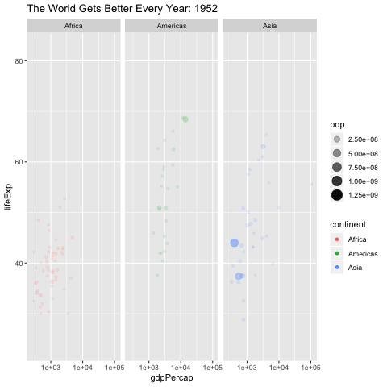

# The World Gets Better Every Year: Comparing Life Expectancy with Time 
## Playing Around with the Gapminder Dataset and gganimate
```{r setup, include=FALSE}
# knitr::opts_chunk$set(echo = FALSE, message = FALSE, warning = FALSE)
# library(tidyverse)
# library(gganimate)
# library(gapminder)
# data("gapminder")
# gganimate dynamic plot displaying 
# gapminder %>%
#   filter(continent %in% c("Americas", "Africa", "Asia")) %>% 
#   ggplot(aes(x = gdpPercap, y = lifeExp, color = continent, size = pop, alpha = pop)) + 
#   geom_point() +
#   scale_x_log10() +
#   transition_time(year) +
#   facet_wrap(~continent) +
#   ggtitle("The World Gets Better Every Year: {frame_time}") 
# 
# ggsave("plot.png")
```




